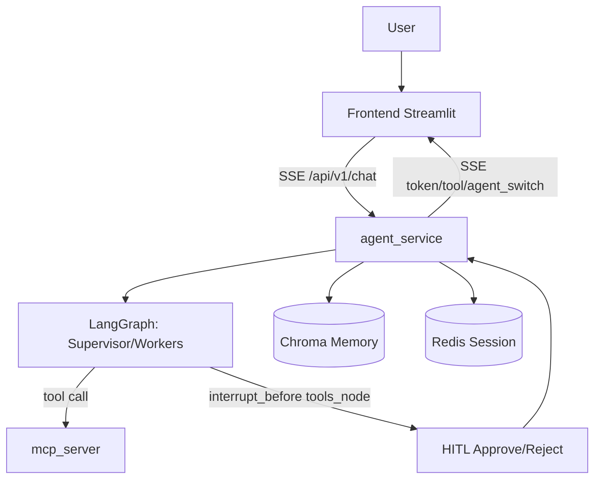

# NanoAgent

🚀 企业级多智能体协作平台（Supervisor + Worker + 技能生态 + MCP 工具层 + 长期记忆）

## 项目概览

NanoAgent 是一个基于 LangGraph 构建的现代化多智能体系统，集成了 Anthropic Agent Skills 标准，提供完整的技能生态和工具管理能力。项目强调以下核心特性：

- **🤖 多智能体协作**：Supervisor 智能统筹，Worker 专业执行，支持动态路由和状态管理
- **📚 技能生态系统**：遵循 Anthropic Agent Skills 标准，支持热插拔技能安装和动态创建
- **🔧 MCP 工具层**：通过 MCP 协议提供标准化的工具调用接口
- **🧠 长期记忆**：基于 Chroma 向量数据库，支持用户隔离的记忆管理
- **⚡ 流式体验**：实时展示 token 流、节点切换、工具调用状态
- **👥 人机协同**：高风险工具调用支持人工审批（HITL）
- **🔒 安全优先**：BYOK 加密、JWT 用户绑定、服务间鉴权

## 项目结构

```text
NanoAgent/
├── .env                    # 环境变量配置
├── .env.example            # 环境变量示例
├── .gitignore             # Git 忽略文件
├── requirements.txt       # Python 依赖包
├── start.bat             # Windows 启动脚本
├── agent_service/         # 智能体核心服务
│   ├── main.py           # FastAPI 主服务入口
│   ├── graph/            # LangGraph 图定义和节点
│   │   ├── nodes.py      # 智能体节点定义
│   │   ├── workflow.py   # 工作流定义
│   │   ├── skills/       # 技能管理模块
│   │   └── prompts.py    # 提示词模板
│   ├── skills/           # 技能库
│   │   ├── chart_maker/  # 图表制作技能
│   │   ├── demo_math/    # 数学计算技能
│   │   ├── hr_assistant/ # HR助手技能
│   │   ├── skill_creator/ # 技能创建器（元技能）
│   │   └── ...           # 更多预置技能
│   ├── memory.py         # 长期记忆管理
│   ├── session_store.py  # 会话存储管理
│   └── data/             # 数据存储目录
│       └── chroma/       # Chroma 向量数据库
├── frontend/              # 前端界面
│   └── app.py            # Streamlit 前端应用
├── mcp_server/            # MCP 工具服务层
│   ├── main.py           # MCP 服务入口
│   ├── tools.py          # 工具定义
│   └── agentdata/        # 工具数据存储
└── tests/                 # 测试文件
    ├── test_db_service.py # 数据库服务测试
    ├── test_mcp_service.py # MCP 服务测试
    └── test_session_store.py # 会话存储测试
```

## 架构说明

### 服务拓扑

- **frontend**（Streamlit，端口 8501） - 用户交互界面
- **agent_service**（FastAPI + LangGraph，端口 8080） - 智能体核心服务
- **mcp_server**（FastAPI + MCP Tool 层，端口 8000） - 工具服务层
- **Chroma**（向量数据库） - 长期记忆存储
- **Redis**（会话存储） - LLM 会话和状态管理

### 高层流程



## Multi-Agent 工作流

状态图核心流程（简化）：

1. `retrieve_memory_node`：按用户检索长期记忆并注入上下文。
2. `supervisor_node`：决定路由到 `DataScientist / Reporter / Assistant / FINISH`。
3. Worker 节点：
   - `data_scientist_node`：可调用 `tool_query_database`
   - `reporter_node`：可调用 `tool_send_report`
   - `assistant_node`：仅聊天（不直接调用高风险工具）
4. `tools_node`：执行工具；若配置 HITL，在此节点前拦截审批。
5. 按 `sender` 回到对应 Worker，形成 ReAct 循环，直至 `END`。

## 核心功能

### 🤖 多智能体工作流

基于 LangGraph 的状态机管理，支持动态路由和协作：

- **Supervisor 节点**：智能分析用户需求，路由到合适的 Worker
- **Worker 节点**：专业执行特定任务（数据分析、报告生成、通用问答）
- **工具节点**：统一管理工具调用，支持 HITL 审批
- **记忆节点**：检索和更新长期记忆，支持上下文增强

### 📚 技能生态系统

遵循 Anthropic Agent Skills 标准，提供完整的技能管理：

- **热插拔技能安装**：支持动态加载和卸载技能
- **技能创建器（Meta-Skill）**：支持动态创建新技能
- **预置技能库**：包含图表制作、数学计算、HR助手、股票查询等
- **标准化接口**：统一的技能描述、参数定义和执行接口

### 🔧 MCP 工具层

通过 MCP（Model Context Protocol）提供标准化的工具调用：

- **数据库查询**：安全的只读 SQL 查询，支持数据分析和报表生成
- **邮件发送**：支持 mock 和 SMTP 双模式，内容长度智能处理
- **文件系统操作**：安全的文件读写和管理能力
- **搜索服务**：集成网络搜索和本地数据检索

### 🧠 长期记忆管理

基于 Chroma 向量数据库的智能记忆系统：

- **用户隔离**：按 `user_id` 严格隔离记忆数据
- **时间戳管理**：支持按时间范围检索和清理
- **上下文增强**：智能检索相关记忆注入对话上下文
- **可配置嵌入**：支持启用/禁用向量嵌入功能

### ⚡ 流式交互体验

实时的事件流传输，提供完整的交互反馈：

- **Token 流**：实时显示模型生成内容
- **节点切换**：可视化智能体工作状态切换
- **工具调用**：实时展示工具执行过程和结果
- **审批中断**：HITL 审批流程的实时交互

### 👥 人机协同（HITL）

高风险操作的人工审批机制：

- **智能拦截**：在工具执行前自动中断等待审批
- **可视化审批**：前端提供清晰的审批界面
- **状态持久化**：审批状态在服务重启后保持
- **安全审计**：完整的审批日志和操作记录

## 邮件能力说明（重要）

默认安全模式：`REPORT_PROVIDER=mock`。

- `mock`：不真实发信，返回模拟成功（适合演示/开源）。
- `smtp`：真实发信（需完整 SMTP 配置）。

超长内容处理采用“中策 + 上策”组合：

- 源头约束：Agent 提示词限制邮件草稿目标长度（`EMAIL_DRAFT_TARGET_CHARS`）。
- 执行降级：超 `REPORT_SOFT_BODY_CHARS` 时改为“摘要正文 + 附件（txt）”。
- 绝对上限：`REPORT_MAX_CONTENT_CHARS` 防止超大 payload 冲击 SMTP。

## 安全设计（当前已实现）

- BYOK 加密存储：用户 LLM API Key 写入 Redis 前使用 Fernet 加密。
- 会话隔离：`session_id` 与用户身份绑定，跨用户不可读取。
- 用户身份绑定：后端以 JWT `sub` 作为真实 `user_id`（忽略前端伪造）。
- 环境分级：
  - `development`：`ALLOWED_LLM_BASE_URLS` 可为空（告警）
  - `production`：白名单为空则启动失败（fail-closed）
- MCP 服务间鉴权：`MCP_SERVICE_TOKEN`。
- 审批状态持久化：LangGraph checkpointer 落地 Postgres，服务重启不丢审批上下文。
- 日志与流式信息默认脱敏，避免泄露敏感参数。

## 🚀 快速开始

### 环境准备

1. **克隆项目**
   ```bash
   git clone <repository-url>
   cd NanoAgent
   ```

2. **安装依赖**
   ```bash
   pip install -r requirements.txt
   ```

3. **配置环境变量**
   ```bash
   cp .env.example .env
   # 编辑 .env 文件，配置必要的环境变量
   ```

### 启动服务

使用提供的启动脚本：
```bash
# Windows
start.bat

# 或手动启动各服务
# 启动 MCP 工具服务 (端口 8000)
cd mcp_server && python main.py

# 启动智能体服务 (端口 8080)  
cd agent_service && python main.py

# 启动前端界面 (端口 8501)
cd frontend && streamlit run app.py
```

## 📦 技能库说明

项目内置了丰富的预置技能，支持开箱即用：

### 核心技能
- **chart_maker** - 数据可视化图表制作
- **demo_math** - 数学计算和问题求解
- **hr_assistant** - 人力资源管理和文档处理
- **password_generator** - 安全密码生成
- **stock_ticker** - 股票信息查询和分析
- **system_monitor** - 系统状态监控
- **url_reader** - 网页内容提取和分析
- **web_searcher** - 网络搜索和信息检索

### 元技能
- **skill_creator** - 动态技能创建器，支持自定义技能开发

## 🔧 开发与扩展

### 添加新技能

1. 在 `agent_service/skills/` 目录下创建技能文件夹
2. 遵循技能标准结构：
   ```
   skill_name/
   ├── scripts/           # 技能执行脚本
   ├── SKILL.md          # 技能描述文档
   └── __init__.py       # 技能注册文件
   ```

3. 技能会自动被系统检测和加载

### 自定义工具

通过 MCP 协议扩展工具能力：
1. 在 `mcp_server/tools.py` 中定义新工具
2. 实现工具的执行逻辑
3. 工具会自动暴露给智能体使用

## 📞 技术支持

- 查看项目文档了解详细配置
- 参考测试文件了解接口使用
- 通过 Issue 反馈问题或建议

```bash
copy .env.example .env
```

### 2. 最小开发配置

在 `.env` 中至少确认：

- `REPORT_PROVIDER=mock`
- `AUTH_REQUIRE_USER_SUB=false`（本地可选，便于无 JWT 快速联调）
- `AUTH_ALLOW_API_KEY_FALLBACK=true`（本地可选）
- `AGENT_API_TOKEN=<你的随机长字符串>`
- `MCP_SERVICE_TOKEN=<你的随机长字符串>`
- `JWT_HS256_SECRET=<你的随机长字符串>`
- `LLM_SESSION_MASTER_KEY=<你的随机长字符串>`

### 3. 启动

```bash
start.bat
```

### 4. 访问

- 前端：`http://localhost:8501`
- 后端：`http://localhost:8080`

## 主要 API

### 一、健康检查接口（2个）

#### 1. GET /health

**作用**：服务存活探针，返回服务状态

**返回**：`{"status": "ok", "service": "agent_service"}`

**用途**：用于容器健康检查和服务监控

#### 2. GET /health/mcp

**作用**：检查上游MCP服务的可达性与健康状态

**功能**：
- 调用MCP服务的 `/health` 端点
- 返回MCP服务的健康状态（正常/降级）

### 二、LLM会话管理接口（4个）

#### 3. GET /api/v1/session/llm/providers

**作用**：返回后端支持的LLM提供商列表

**功能**：
- 返回支持的提供商（qwen、openai、deepseek、groq等）
- 包含每个提供商的默认配置（base_url、embedding_model等）
- 供前端配置页使用

#### 4. POST /api/v1/session/llm/validate

**作用**：校验用户输入的LLM配置是否可用

**功能**：
- 验证API key、base_url、model等配置
- 可选择验证聊天功能和embedding功能
- 返回验证结果和错误信息

#### 5. POST /api/v1/session/llm

**作用**：创建会话级LLM凭据（BYOK模式）

**功能**：
- 加密存储用户的API密钥和配置
- 支持设置会话过期时间（TTL）
- 返回session_id用于后续聊天请求
- 每个会话绑定到特定用户

#### 6. DELETE /api/v1/session/llm/{session_id}

**作用**：主动销毁会话级LLM凭据

**功能**：
- 删除指定的LLM会话
- 验证会话归属权（只能删除自己的会话）
- 清理加密存储的凭据

### 三、聊天与审批接口（2个）

#### 7. POST /api/v1/chat

**作用**：以SSE流式方式执行Agent图并实时返回token

**功能**：
- 接收用户查询，执行完整的Agent工作流
- 支持工具调用（数据库查询、发送邮件等）
- 自动检测并处理待审批的工具调用
- 自动写入用户自述背景到长期记忆
- 返回SSE流式响应（实时token、工具事件等）

#### 8. POST /api/v1/chat/resume

**作用**：对已中断的工具调用进行审批并恢复执行

**功能**：
- 支持两种操作：`approve`（批准）和`reject`（拒绝）
- 恢复被中断的Agent执行流程
- 处理审批结果并继续生成响应

### 四、长期记忆管理接口（3个）

#### 9. POST /api/v1/memory

**作用**：将用户偏好写入长期记忆

**功能**：
- 使用embedding模型将文本向量化存储
- 支持后续语义检索
- 需要配置embedding模型
- 返回memory_id用于管理

#### 10. GET /api/v1/memory/{user_id}

**作用**：查看某个用户的长期记忆列表

**功能**：
- 支持分页查询（limit参数，默认50条，最大200条）
- 返回用户的所有记忆条目
- 包含记忆ID和文本内容

#### 11. DELETE /api/v1/memory/{user_id}/{memory_id}

**作用**：删除某个用户的一条长期记忆

**功能**：
- 验证记忆归属权
- 删除指定的记忆条目
- 返回删除结果

## 数据库查询能力怎么用

`query_database` 是“受限只读查询工具”，常用探测 SQL 示例：

```sql
SELECT datname FROM pg_database;
SELECT table_name FROM information_schema.tables WHERE table_schema='public' ORDER BY table_name;
SELECT column_name, data_type FROM information_schema.columns WHERE table_name='agent_user_settings';
```

推荐向 Agent 提问方式：

- “请用数据库工具列出当前数据库的所有表名。”
- “请先查询 `public` 下的表，再告诉我每个表大致用途。”
- “请查询 `agent_user_settings` 的字段结构，不要修改任何数据。”


## 开源发布前检查清单

- 只提交 `.env.example`，不要提交真实 `.env`。
- 不要提交日志、缓存、数据库快照、浏览器导出数据。
- 确认以下密钥均为占位符：
  - `AGENT_API_TOKEN`
  - `AGENT_API_KEYS`
  - `JWT_HS256_SECRET`
  - `LLM_SESSION_MASTER_KEY`
  - `MCP_SERVICE_TOKEN`
  - `SMTP_PASSWORD`
- 建议执行一次敏感扫描：

```bash
rg -n "sk-|AKIA|BEGIN PRIVATE KEY|JWT_HS256_SECRET|AGENT_API_TOKEN|SMTP_PASSWORD" .
```

## 安全路线图（Roadmap）

- KMS / Vault 托管主密钥（替代应用层环境变量托管）。
- 邮件链路升级为 Outbox + 异步 Worker + 重试 + 死信队列 + 可观测指标。
- Redis 令牌桶限流（如每用户 `60 req/min`）。
- 公网生产改为 OIDC/JWKS（`JWT_JWKS_URL + issuer + audience`）。

## License

本项目使用 [MIT License](./LICENSE)。