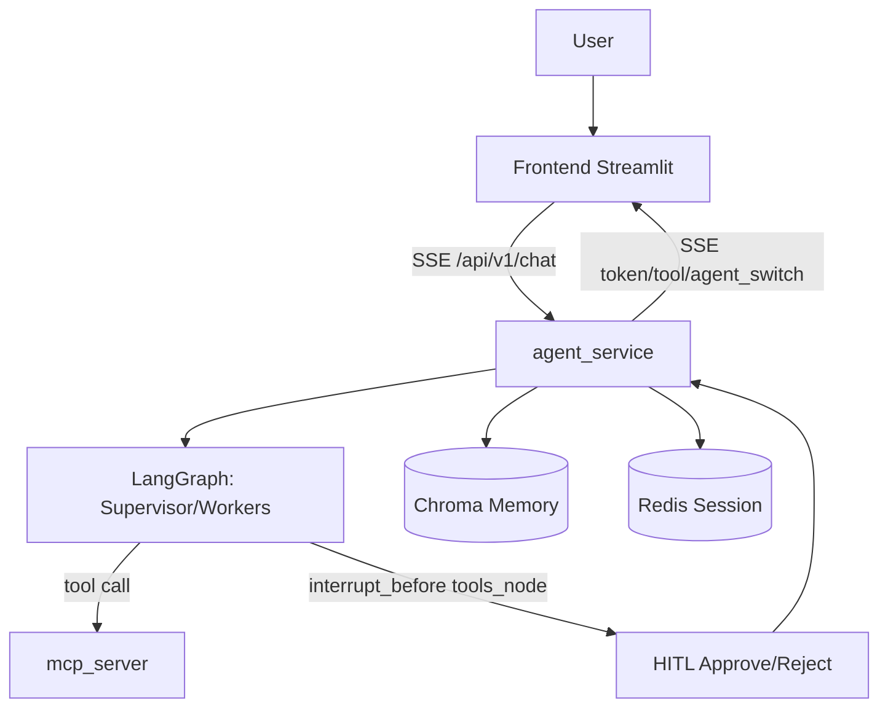

# NanoAgent

企业级 Multi-Agent 智能体项目（Supervisor + Worker + HITL 审批 + 长期记忆 + MCP 工具层）。

## 项目概览

NanoAgent 是一个基于 LangGraph 的多智能体协作系统，提供可落地、可演示、可扩展的企业级 AI Agent 基线工程，强调以下核心能力：

- **多智能体协作**：Supervisor 统筹分派，DataScientist 负责数据库分析，Reporter 负责邮件报告，Assistant 处理通用问答
- **长期记忆**：基于 Chroma 向量库，按 `user_id` 隔离检索与管理
- **工具层解耦**：通过 MCP 协议提供数据库查询、报告发送等工具能力
- **流式体验**：前端实时展示 token、节点切换、工具调用状态
- **人机协同审批（HITL）**：高风险工具调用支持人工审批后再执行
- **安全优先**：BYOK 会话密钥加密存储、JWT 用户绑定、服务间鉴权

## 目录结构

```text
NanoAgent/
├── .env                    # 环境变量配置
├── .env.example            # 环境变量示例
├── .gitignore             # Git 忽略文件
├── requirements.txt       # Python 依赖包
├── start.bat             # Windows 启动脚本
├── agent_service/         # 智能体服务
│   ├── main.py           # FastAPI 主服务入口
│   ├── graph.py          # LangGraph 图定义
│   ├── memory.py         # 长期记忆管理
│   ├── session_store.py  # 会话存储管理
│   ├── start_agent.py    # 智能体启动脚本
│   └── data/             # 数据存储目录
│       └── chroma/       # Chroma 向量数据库
├── frontend/              # 前端界面
│   └── app.py            # Streamlit 前端应用
├── mcp_server/            # MCP 工具服务
│   └── main.py           # MCP 服务入口
└── tests/                 # 测试文件
    ├── create_database.py # 数据库创建测试
    ├── test_db_service.py # 数据库服务测试
    ├── test_mcp_service.py # MCP 服务测试
    ├── test_redis.py     # Redis 测试
    └── test_session_store.py # 会话存储测试
```

## 架构说明

### 服务拓扑

- **frontend**（Streamlit，端口 8501） - 用户交互界面
- **agent_service**（FastAPI + LangGraph，端口 8080） - 智能体核心服务
- **mcp_server**（FastAPI + MCP Tool 层，端口 8000） - 工具服务层
- **Chroma**（向量数据库） - 长期记忆存储
- **Redis**（会话存储） - LLM 会话和状态管理

### 高层流程



## Multi-Agent 工作流

状态图核心流程（简化）：

1. `retrieve_memory_node`：按用户检索长期记忆并注入上下文。
2. `supervisor_node`：决定路由到 `DataScientist / Reporter / Assistant / FINISH`。
3. Worker 节点：
   - `data_scientist_node`：可调用 `tool_query_database`
   - `reporter_node`：可调用 `tool_send_report`
   - `assistant_node`：仅聊天（不直接调用高风险工具）
4. `tools_node`：执行工具；若配置 HITL，在此节点前拦截审批。
5. 按 `sender` 回到对应 Worker，形成 ReAct 循环，直至 `END`。

## 核心功能

### 1) 流式聊天（SSE）

后端 `/api/v1/chat` 返回事件流，前端实时消费：

- `token`：模型输出片段
- `agent_switch`：节点切换状态
- `tool_start / tool_end`：工具调用生命周期
- `interrupt`：命中 HITL 待审批
- `[DONE]`：本轮结束

### 2) 人机协同审批（HITL）

- 图编译时使用 `interrupt_before=["tools_node"]`。
- 前端收到 `interrupt` 后渲染“允许/拒绝”操作。
- `/api/v1/chat/resume` 支持审批续跑。

### 3) 长期记忆（Long-Term Memory）

- 使用 `chromadb.PersistentClient("/app/data/chroma")`。
- 记忆写入包含 `user_id + timestamp` 元数据。
- 检索时强制按 `user_id` 过滤，支持查看与删除。
- `embedding_model` 留空时，表示禁用 embedding（不写入向量记忆）。

### 4) MCP 工具层

`mcp_server` 暴露工具代理接口：

- `query_database(sql)`：仅允许只读 `SELECT/CTE`，禁止 DDL/DML、多语句。
- `send_report(email, content)`：支持 `mock/smtp` 双模式。
- `upsert_user_setting(...)`：受控写工具（按服务侧用户上下文隔离）。

## 邮件能力说明（重要）

默认安全模式：`REPORT_PROVIDER=mock`。

- `mock`：不真实发信，返回模拟成功（适合演示/开源）。
- `smtp`：真实发信（需完整 SMTP 配置）。

超长内容处理采用“中策 + 上策”组合：

- 源头约束：Agent 提示词限制邮件草稿目标长度（`EMAIL_DRAFT_TARGET_CHARS`）。
- 执行降级：超 `REPORT_SOFT_BODY_CHARS` 时改为“摘要正文 + 附件（txt）”。
- 绝对上限：`REPORT_MAX_CONTENT_CHARS` 防止超大 payload 冲击 SMTP。

## 安全设计（当前已实现）

- BYOK 加密存储：用户 LLM API Key 写入 Redis 前使用 Fernet 加密。
- 会话隔离：`session_id` 与用户身份绑定，跨用户不可读取。
- 用户身份绑定：后端以 JWT `sub` 作为真实 `user_id`（忽略前端伪造）。
- 环境分级：
  - `development`：`ALLOWED_LLM_BASE_URLS` 可为空（告警）
  - `production`：白名单为空则启动失败（fail-closed）
- MCP 服务间鉴权：`MCP_SERVICE_TOKEN`。
- 审批状态持久化：LangGraph checkpointer 落地 Postgres，服务重启不丢审批上下文。
- 日志与流式信息默认脱敏，避免泄露敏感参数。

## 快速启动

### 1. 准备环境变量

```bash
copy .env.example .env
```

### 2. 最小开发配置

在 `.env` 中至少确认：

- `REPORT_PROVIDER=mock`
- `AUTH_REQUIRE_USER_SUB=false`（本地可选，便于无 JWT 快速联调）
- `AUTH_ALLOW_API_KEY_FALLBACK=true`（本地可选）
- `AGENT_API_TOKEN=<你的随机长字符串>`
- `MCP_SERVICE_TOKEN=<你的随机长字符串>`
- `JWT_HS256_SECRET=<你的随机长字符串>`
- `LLM_SESSION_MASTER_KEY=<你的随机长字符串>`

### 3. 启动

```bash
start.bat
```

### 4. 访问

- 前端：`http://localhost:8501`
- 后端：`http://localhost:8080`

## 主要 API

### 一、健康检查接口（2个）

#### 1. GET /health

**作用**：服务存活探针，返回服务状态

**返回**：`{"status": "ok", "service": "agent_service"}`

**用途**：用于容器健康检查和服务监控

#### 2. GET /health/mcp

**作用**：检查上游MCP服务的可达性与健康状态

**功能**：
- 调用MCP服务的 `/health` 端点
- 返回MCP服务的健康状态（正常/降级）

### 二、LLM会话管理接口（4个）

#### 3. GET /api/v1/session/llm/providers

**作用**：返回后端支持的LLM提供商列表

**功能**：
- 返回支持的提供商（qwen、openai、deepseek、groq等）
- 包含每个提供商的默认配置（base_url、embedding_model等）
- 供前端配置页使用

#### 4. POST /api/v1/session/llm/validate

**作用**：校验用户输入的LLM配置是否可用

**功能**：
- 验证API key、base_url、model等配置
- 可选择验证聊天功能和embedding功能
- 返回验证结果和错误信息

#### 5. POST /api/v1/session/llm

**作用**：创建会话级LLM凭据（BYOK模式）

**功能**：
- 加密存储用户的API密钥和配置
- 支持设置会话过期时间（TTL）
- 返回session_id用于后续聊天请求
- 每个会话绑定到特定用户

#### 6. DELETE /api/v1/session/llm/{session_id}

**作用**：主动销毁会话级LLM凭据

**功能**：
- 删除指定的LLM会话
- 验证会话归属权（只能删除自己的会话）
- 清理加密存储的凭据

### 三、聊天与审批接口（2个）

#### 7. POST /api/v1/chat

**作用**：以SSE流式方式执行Agent图并实时返回token

**功能**：
- 接收用户查询，执行完整的Agent工作流
- 支持工具调用（数据库查询、发送邮件等）
- 自动检测并处理待审批的工具调用
- 自动写入用户自述背景到长期记忆
- 返回SSE流式响应（实时token、工具事件等）

#### 8. POST /api/v1/chat/resume

**作用**：对已中断的工具调用进行审批并恢复执行

**功能**：
- 支持两种操作：`approve`（批准）和`reject`（拒绝）
- 恢复被中断的Agent执行流程
- 处理审批结果并继续生成响应

### 四、长期记忆管理接口（3个）

#### 9. POST /api/v1/memory

**作用**：将用户偏好写入长期记忆

**功能**：
- 使用embedding模型将文本向量化存储
- 支持后续语义检索
- 需要配置embedding模型
- 返回memory_id用于管理

#### 10. GET /api/v1/memory/{user_id}

**作用**：查看某个用户的长期记忆列表

**功能**：
- 支持分页查询（limit参数，默认50条，最大200条）
- 返回用户的所有记忆条目
- 包含记忆ID和文本内容

#### 11. DELETE /api/v1/memory/{user_id}/{memory_id}

**作用**：删除某个用户的一条长期记忆

**功能**：
- 验证记忆归属权
- 删除指定的记忆条目
- 返回删除结果

## 数据库查询能力怎么用

`query_database` 是“受限只读查询工具”，常用探测 SQL 示例：

```sql
SELECT datname FROM pg_database;
SELECT table_name FROM information_schema.tables WHERE table_schema='public' ORDER BY table_name;
SELECT column_name, data_type FROM information_schema.columns WHERE table_name='agent_user_settings';
```

推荐向 Agent 提问方式：

- “请用数据库工具列出当前数据库的所有表名。”
- “请先查询 `public` 下的表，再告诉我每个表大致用途。”
- “请查询 `agent_user_settings` 的字段结构，不要修改任何数据。”


## 开源发布前检查清单

- 只提交 `.env.example`，不要提交真实 `.env`。
- 不要提交日志、缓存、数据库快照、浏览器导出数据。
- 确认以下密钥均为占位符：
  - `AGENT_API_TOKEN`
  - `AGENT_API_KEYS`
  - `JWT_HS256_SECRET`
  - `LLM_SESSION_MASTER_KEY`
  - `MCP_SERVICE_TOKEN`
  - `SMTP_PASSWORD`
- 建议执行一次敏感扫描：

```bash
rg -n "sk-|AKIA|BEGIN PRIVATE KEY|JWT_HS256_SECRET|AGENT_API_TOKEN|SMTP_PASSWORD" .
```

## 安全路线图（Roadmap）

- KMS / Vault 托管主密钥（替代应用层环境变量托管）。
- 邮件链路升级为 Outbox + 异步 Worker + 重试 + 死信队列 + 可观测指标。
- Redis 令牌桶限流（如每用户 `60 req/min`）。
- 公网生产改为 OIDC/JWKS（`JWT_JWKS_URL + issuer + audience`）。

## License

本项目使用 [MIT License](./LICENSE)。