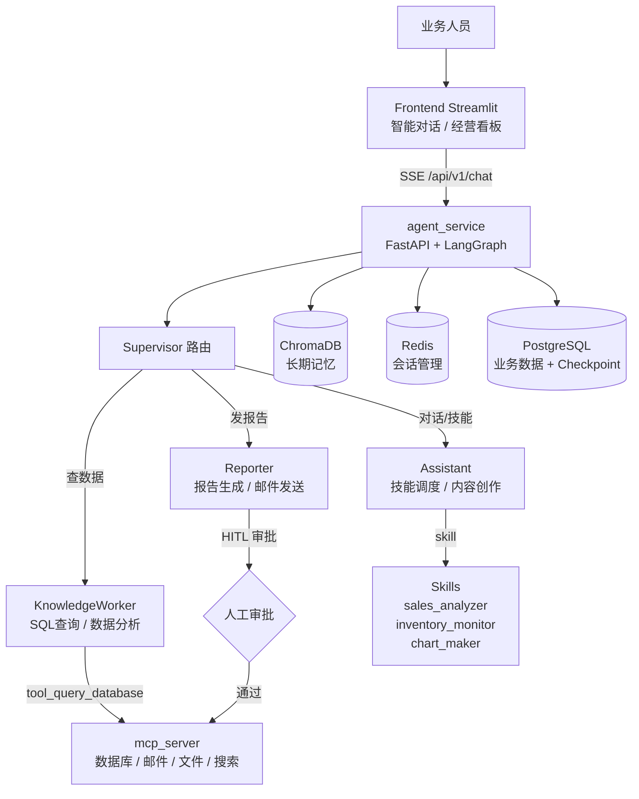

# NanoAgent — 企业经营分析智能助手

🚀 基于多智能体协作的经营数据分析平台（自然语言问数据 · 自动生成报告 · 邮件一键分发）

## 业务场景

NanoAgent 面向零售/电商企业的管理层与业务分析师，提供**自然语言驱动的经营分析**能力：

- 业务人员用**自然语言提问**，AI 自动查询数据库、分析趋势、生成图表
- 自动生成结构化**经营报告**（日报/周报/月报），经人工确认后邮件分发
- 智能记忆用户关注的区域、指标和收件人偏好，越用越懂你

**典型对话示例：**

> "帮我看看上个月华东区的销售额，和去年同期做个对比"
>
> "库存周转率最低的前10个SKU是什么？生成柱状图"
>
> "生成本月经营报告，发送到 manager@company.com"

## 核心能力

| 能力 | 说明 |
|------|------|
| 销售分析 | 同比/环比趋势、区域对比、品类拆解、TopN排名、客户价值分析 |
| 库存监控 | 缺货预警、滞销分析、周转率计算、补货建议 |
| 财务概览 | 营收/利润趋势、费用结构、毛利率分析 |
| 报告生成 | Markdown/HTML 双格式报告，图表嵌入，一键邮件分发 |
| 竞品调研 | 网络搜索 → 信息提炼 → 结构化竞品分析报告 |
| 人机协同 | 外部邮件/敏感报告需人工审批，内部邮件自动放行 |

## 项目结构

```text
NanoAgent/
├── agent_service/              # 智能体核心服务 (FastAPI + LangGraph)
│   ├── graph/
│   │   ├── nodes.py            # 智能体节点（Supervisor/KnowledgeWorker/Reporter/Assistant）
│   │   ├── workflow.py         # LangGraph 状态机定义
│   │   ├── routes.py           # 条件路由（含 HITL 权限分级）
│   │   ├── prompts.py          # 业务领域提示词（含数据库 Schema）
│   │   ├── tools.py            # LangChain 工具封装
│   │   └── config.py           # 配置常量
│   ├── skills/                 # 热插拔技能库
│   │   ├── sales_analyzer/     # 销售数据分析专家
│   │   ├── inventory_monitor/  # 库存监控分析专家
│   │   ├── chart_maker/        # 图表可视化
│   │   ├── hr_assistant/       # HR 助手
│   │   ├── skill_creator/      # 元技能：动态创建新技能
│   │   └── ...                 # 更多技能
│   ├── memory.py               # 长期记忆管理（ChromaDB 向量存储）
│   ├── utils.py                # 工具函数（含业务偏好自动识别）
│   └── main.py                 # FastAPI 入口
├── frontend/                   # 前端界面 (Streamlit)
│   └── app.py                  # 智能对话 + 经营看板双 Tab
├── mcp_server/                 # MCP 工具服务层
│   ├── tools.py                # 工具注册（数据库/邮件/文件/搜索）
│   ├── database.py             # 异步 PostgreSQL 查询
│   ├── email_service.py        # 邮件发送（Mock/SMTP，支持 HTML）
│   ├── security.py             # SQL 安全守卫
│   └── seed_business_data.sql  # 业务数据库初始化脚本
└── nanoagent-java/             # Java 版本（Spring Boot 3 + Spring AI）
    ├── nano-agent-service/
    ├── nano-mcp-server/
    └── nano-frontend/
```

## 架构总览


```mermaid
flowchart TD
    U[业务人员] --> F[Frontend Streamlit<br/>智能对话 / 经营看板]
    F -->|SSE /api/v1/chat| A[agent_service<br/>FastAPI + LangGraph]
    A --> SUP[Supervisor 路由]
    SUP -->|查数据| KW[KnowledgeWorker<br/>SQL查询 / 数据分析]
    SUP -->|发报告| REP[Reporter<br/>报告生成 / 邮件发送]
    SUP -->|对话/技能| AST[Assistant<br/>技能调度 / 内容创作]
    KW -->|tool_query_database| MCP[mcp_server<br/>数据库 / 邮件 / 文件 / 搜索]
    REP -->|HITL 审批| H{人工审批}
    H -->|通过| MCP
    AST -->|skill| SK[Skills<br/>sales_analyzer<br/>inventory_monitor<br/>chart_maker]
    A --> C[(ChromaDB<br/>长期记忆)]
    A --> R[(Redis<br/>会话管理)]
    A --> P[(PostgreSQL<br/>业务数据 + Checkpoint)]
```

### Multi-Agent 工作流

1. `retrieve_memory_node` — 检索用户长期记忆（偏好区域/指标/收件人）
2. `supervisor_node` — 语义路由，输出一个词：KnowledgeWorker / Reporter / Assistant / FINISH
3. Worker 节点：
   - `knowledge_worker_node` — 数据查询与分析，支持 ReAct 循环调用工具
   - `reporter_node` — 报告生成与邮件发送
   - `assistant_node` — 技能调度（调用 sales_analyzer / inventory_monitor 等）
4. `tools_node` — 执行 MCP 工具
5. `permission_tools_node` — HITL 审批拦截（内外部邮件分级策略）

### HITL 权限分级

| 场景 | 处理方式 |
|------|----------|
| 发送报告到内部邮箱 | 自动放行 |
| 发送报告到外部邮箱 | 需人工审批 |
| 报告含财务敏感数据 | 强制人工审批 |

## 业务数据库

通过 `seed_business_data.sql` 初始化，包含 5 张核心业务表：

| 表名 | 说明 | 示例数据 |
|------|------|----------|
| `products` | 产品表 | 20 个 SKU，覆盖电子/服装/食品/家居 |
| `customers` | 客户表 | 30 个客户，覆盖 7 大区域 |
| `sales_orders` | 销售订单表 | 500+ 笔订单，跨度 6 个月 |
| `inventory` | 库存表 | 多仓库库存，含缺货/低库存样本 |
| `finance_monthly` | 财务月报表 | 6 个月营收/成本/利润数据 |

```bash
# 初始化业务数据
psql -U your_user -d your_db -f mcp_server/seed_business_data.sql
```

## 技能库

| 技能 | 说明 |
|------|------|
| `sales_analyzer` | 销售数据分析：趋势图/对比图/饼图，支持同比/环比/区域/品类 |
| `inventory_monitor` | 库存监控：健康概览/滞销预警/周转率图表 |
| `chart_maker` | 通用图表制作（折线图/柱状图） |
| `hr_assistant` | HR 政策问答 |
| `stock_ticker` | 股票信息查询 |
| `system_monitor` | 系统状态监控 |
| `url_reader` | 网页内容提取 |
| `web_searcher` | 网络搜索 |
| `skill_creator` | 元技能：动态创建新技能 |

## 前端界面

Streamlit 前端提供两个 Tab：

- **智能对话** — 流式对话、思维链可视化、HITL 审批面板、文件上传、多会话管理
- **经营看板** — 8 个快捷查询按钮（本月销售/区域排名/库存预警/热销Top10/品类占比/财务趋势/客户分析/滞销预警）+ 3 个快速报告模板

## 邮件报告

- **Mock 模式**（默认）：不真实发信，适合演示/开发
- **SMTP 模式**：真实发信，支持 HTML 双格式（纯文本 + 富媒体）
- **HTML 报告**：自动将 Markdown 转为带样式的 HTML 邮件（渐变标题、表格边框、响应式布局）
- **超长处理**：摘要正文 + 附件保留全文

## 安全设计

- **BYOK 加密**：用户 API Key 使用 Fernet 加密后存入 Redis
- **会话隔离**：`session_id` 绑定用户身份，跨用户不可读取
- **SQL 安全**：只读查询、行数限制（200）、超时保护（3s）、危险函数黑名单
- **HITL 审批**：敏感操作人工确认，审批状态持久化到 Postgres
- **日志脱敏**：API Key、邮箱等敏感信息不输出明文

## 快速开始

### 1. 安装依赖

```bash
pip install -r requirements.txt
```

### 2. 配置环境变量

```bash
cp .env.example .env
# 编辑 .env，至少配置：
# AGENT_API_TOKEN=<随机字符串>
# MCP_SERVICE_TOKEN=<随机字符串>
# JWT_HS256_SECRET=<随机字符串>
# LLM_SESSION_MASTER_KEY=<随机字符串>
# REPORT_PROVIDER=mock
```

### 3. 初始化业务数据库

```bash
psql -U your_user -d your_db -f mcp_server/seed_business_data.sql
```

### 4. 启动服务

```bash
# Windows
start.bat

# 或手动启动
cd mcp_server && python main.py       # MCP 工具服务 (端口 8000)
cd agent_service && python main.py    # 智能体服务 (端口 8080)
cd frontend && streamlit run app.py   # 前端界面 (端口 8501)
```

### 5. 访问

- 前端：`http://localhost:8501`
- 后端：`http://localhost:8080`

## 主要 API

| 方法 | 路径 | 说明 |
|------|------|------|
| POST | `/api/v1/chat` | SSE 流式对话（核心入口） |
| POST | `/api/v1/chat/resume` | HITL 审批（approve/reject） |
| POST | `/api/v1/memory` | 写入长期记忆 |
| GET | `/api/v1/memory/{user_id}` | 查看记忆列表 |
| DELETE | `/api/v1/memory/{user_id}/{memory_id}` | 删除记忆 |
| POST | `/api/v1/session/llm` | 创建 BYOK LLM 会话 |
| GET | `/api/v1/session/llm/providers` | 获取支持的模型提供商 |
| POST | `/api/v1/upload` | 文件上传 |
| GET | `/health` | 健康检查 |

## 环境变量参考

| 变量 | 默认值 | 说明 |
|------|--------|------|
| `REPORT_PROVIDER` | `mock` | 邮件模式：mock / smtp |
| `REPORT_INTERNAL_EMAIL_DOMAINS` | (空) | 内部邮箱域名，逗号分隔（发送到这些域名免审批） |
| `SMTP_HOST` | (空) | SMTP 服务器地址 |
| `GRAPH_CHECKPOINTER_BACKEND` | `postgres` | 审批状态存储：postgres / redis / memory |
| `MAX_MODEL_HISTORY_MESSAGES` | `6` | 上下文窗口消息数 |

## License

本项目使用 [MIT License](./LICENSE)。
